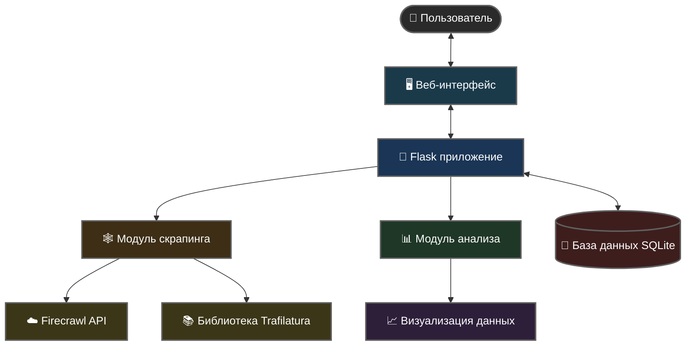

# Avito Real Estate Analyzer

Платформа для скрапинга и анализа данных о недвижимости с сайта Avito с расширенными возможностями визуализации и интеллектуального анализа.

## Общее описание

Avito Real Estate Analyzer — веб-приложение, созданное для сбора, хранения и анализа данных о недвижимости с сайта Avito. Система использует двойной подход к извлечению данных: приоритетно использует API Firecrawl, а в случае отказа автоматически переключается на библиотеку trafilatura. Благодаря продвинутым алгоритмам извлечения данных, система эффективно распознает информацию о недвижимости в различных форматах и сохраняет её в структурированном виде.

## Ключевые особенности

- **Двойная система скрапинга**: Приоритетное использование API Firecrawl с автоматическим переключением на trafilatura при необходимости
- **Надежное извлечение данных**: Улучшенные алгоритмы для извлечения ключевой информации о недвижимости
- **Расширенная визуализация**: Гибкие параметры для настройки гистограмм и визуализации данных
- **Хранение исторических данных**: Сохранение всех собранных данных в базе данных для трендового анализа
- **Интуитивный интерфейс**: Современный веб-интерфейс с отзывчивым дизайном

## Архитектура системы

### High-Level архитектура
https://www.mermaidchart.com/raw/e3ca045f-5efe-4cf6-97ed-0fee244d8889?theme=light&version=v0.1&format=svg


### Low-Level архитектура
https://www.mermaidchart.com/raw/3aadefdc-eb89-46f9-8020-80929f073137?theme=light&version=v0.1&format=svg

```mermaid
flowchart TB
    subgraph "Пользовательский интерфейс"
        IndexPage["/ (Главная страница)"]
        ResultsPage["/results (Страница результатов)"]
        APIData["/api/data/:id (API данных)"]
        APIAnalysis["/api/analysis/:id (API анализа)"]
    end
    
    subgraph "Основные модули"
        AppModule["app.py (Flask приложение)"]
        MainModule["main.py (Точка входа)"]
        ModelsModule["models.py (Модели данных)"]
    end
    
    subgraph "Модуль скрапинга"
        ScraperModule["scraper.py"]
        FirecrawlClient["FirecrawlApp класс"]
        TrafilaturaExtractor["get_website_text_content()"]
        AvitoParser["extract_avito_listings_from_text()"]
    end
    
    subgraph "Модуль анализа"
        AnalyzerModule["analyzer.py"]
        VisualizationEngine["generate_visualization()"]
        DataProcessor["analyze_data()"]
        OutlierRemoval["remove_outliers()"]
    end
    
    subgraph "База данных"
        ScrapedDataTable["ScrapedData таблица"]
        AnalysisResultTable["AnalysisResult таблица"]
    end
    
    IndexPage --> AppModule
    ResultsPage --> AppModule
    APIData --> AppModule
    APIAnalysis --> AppModule
    
    AppModule --> MainModule
    AppModule --> ModelsModule
    AppModule --> ScraperModule
    AppModule --> AnalyzerModule
    
    ScraperModule --> FirecrawlClient
    ScraperModule --> TrafilaturaExtractor
    ScraperModule --> AvitoParser
    
    FirecrawlClient --> ExternalFirecrawl["Внешний API Firecrawl"]
    ScraperModule --> ModelsModule
    
    AnalyzerModule --> VisualizationEngine
    AnalyzerModule --> DataProcessor
    AnalyzerModule --> OutlierRemoval
    AnalyzerModule --> ModelsModule
    
    ModelsModule --> ScrapedDataTable
    ModelsModule --> AnalysisResultTable
    
    style IndexPage fill:#1e1e1e,stroke:#aaa,stroke-width:1px,color:#ffffff
    style ResultsPage fill:#1e1e1e,stroke:#aaa,stroke-width:1px,color:#ffffff
    style APIData fill:#1e1e1e,stroke:#aaa,stroke-width:1px,color:#ffffff
    style APIAnalysis fill:#1e1e1e,stroke:#aaa,stroke-width:1px,color:#ffffff
    
    style AppModule fill:#252526,stroke:#777,stroke-width:1px,color:#ffffff
    style MainModule fill:#252526,stroke:#777,stroke-width:1px,color:#ffffff
    style ModelsModule fill:#252526,stroke:#777,stroke-width:1px,color:#ffffff
    
    style ScraperModule fill:#3a3a3a,stroke:#777,stroke-width:1px,color:#ffffff
    style FirecrawlClient fill:#3a3a3a,stroke:#777,stroke-width:1px,color:#ffffff
    style TrafilaturaExtractor fill:#3a3a3a,stroke:#777,stroke-width:1px,color:#ffffff
    style AvitoParser fill:#3a3a3a,stroke:#777,stroke-width:1px,color:#ffffff
    
    style AnalyzerModule fill:#2e3b2e,stroke:#777,stroke-width:1px,color:#ffffff
    style VisualizationEngine fill:#2e3b2e,stroke:#777,stroke-width:1px,color:#ffffff
    style DataProcessor fill:#2e3b2e,stroke:#777,stroke-width:1px,color:#ffffff
    style OutlierRemoval fill:#2e3b2e,stroke:#777,stroke-width:1px,color:#ffffff
    
    style ScrapedDataTable fill:#4b2b2b,stroke:#777,stroke-width:1px,color:#ffffff
    style AnalysisResultTable fill:#4b2b2b,stroke:#777,stroke-width:1px,color:#ffffff
    
    style ExternalFirecrawl fill:#5a482b,stroke:#777,stroke-width:1px,color:#ffffff

```


## Структура файлов проекта

- **main.py**: Точка входа приложения, запуск Flask сервера
- **app.py**: Основное Flask приложение, маршрутизация и обработка запросов
- **models.py**: Модели данных для взаимодействия с базой данных
- **scraper.py**: Модуль для скрапинга данных с Avito через Firecrawl API и/или Trafilatura
- **analyzer.py**: Модуль для анализа и визуализации собранных данных
- **templates/**: Папка с HTML шаблонами
  - **index.html**: Главная страница с формой для скрапинга и анализа
  - **results.html**: Страница отображения результатов анализа
- **static/**: Папка со статическими файлами (CSS, JavaScript)

## Процесс потока данных

1. **Пользовательский ввод**: Пользователь вводит URL страницы с объявлениями Avito
2. **Скрапинг данных**:
   - Система проверяет наличие API ключа Firecrawl
   - Если ключ доступен, использует API Firecrawl для получения данных
   - В случае ошибки или отсутствия ключа использует Trafilatura
   - Данные извлекаются и сохраняются в базе данных
3. **Анализ данных**:
   - Пользователь выбирает параметры для анализа (цена, площадь, комнаты)
   - Система обрабатывает данные, удаляет выбросы и генерирует статистику
   - Создается визуальное представление в виде гистограммы
4. **Отображение результатов**:
   - Отображаются гистограмма и статистические показатели
   - Пользователь может выполнять дополнительный анализ или скрапинг

## Модели данных

### ScrapedData

Хранит данные, собранные с Avito:

- `id`: Уникальный идентификатор
- `url`: URL страницы, с которой были собраны данные
- `data`: JSON-строка со структурированными данными
- `created_at`: Дата и время создания записи

### AnalysisResult

Хранит результаты анализа:

- `id`: Уникальный идентификатор
- `data_id`: Ссылка на исходные данные (ScrapedData)
- `parameter`: Параметр, который был проанализирован (цена, площадь и т.д.)
- `title`: Пользовательское название анализа
- `bins`: Количество бинов для гистограммы
- `statistics`: JSON-строка со статистическими показателями
- `visualization_data`: JSON-строка с данными для визуализации
- `created_at`: Дата и время создания анализа

## Модуль скрапинга

Модуль скрапинга реализует два метода извлечения данных:

1. **Firecrawl API** (приоритетный метод):
   - Использует API Firecrawl для извлечения структурированных данных
   - Поддерживает как синхронные, так и асинхронные запросы
   - Требует API ключа Firecrawl

2. **Trafilatura** (запасной метод):
   - Использует библиотеку Trafilatura для извлечения текстового содержимого
   - Применяет расширенный алгоритм анализа для извлечения информации о недвижимости
   - Использует сложные регулярные выражения для обнаружения цен, местоположения и других деталей

## Модуль анализа

Модуль анализа предоставляет следующие функции:

1. **Статистическая обработка**:
   - Расчет основных статистических показателей (среднее, медиана, мин/макс)
   - Удаление выбросов для более точного анализа
   - Сегментация данных по различным параметрам

2. **Визуализация**:
   - Генерация гистограмм с настраиваемым количеством бинов
   - Оптимизация масштаба для лучшего визуального представления
   - Создание интерактивных графиков

## Требования

- Python 3.8 или выше
- Flask и Flask-SQLAlchemy
- Trafilatura для извлечения данных
- Pandas и Matplotlib для анализа и визуализации
- API ключ Firecrawl для использования API (опционально)

## Настройка и запуск

1. Установите зависимости:
```bash
pip install flask flask-sqlalchemy trafilatura pandas matplotlib requests aiohttp
```

2. Установите API ключ Firecrawl (опционально):
```bash
export FIRECRAWL_API_KEY="ваш_ключ_api"
```

3. Запустите приложение:
```bash
python main.py
```

4. Откройте браузер и перейдите по адресу `http://localhost:5000`

## Использование

1. Введите URL страницы Avito с объявлениями о недвижимости
2. Нажмите кнопку "Скрапить данные"
3. После успешного скрапинга выберите параметр для анализа и другие настройки
4. Нажмите кнопку "Анализировать"
5. Просмотрите результаты на странице результатов

## Дальнейшее развитие

- Добавление поддержки дополнительных сайтов недвижимости
- Расширение возможностей анализа (корреляция между параметрами)
- Прогнозирование цен на основе исторических данных
- Улучшение пользовательского интерфейса и визуализации
- Экспорт данных в различные форматы